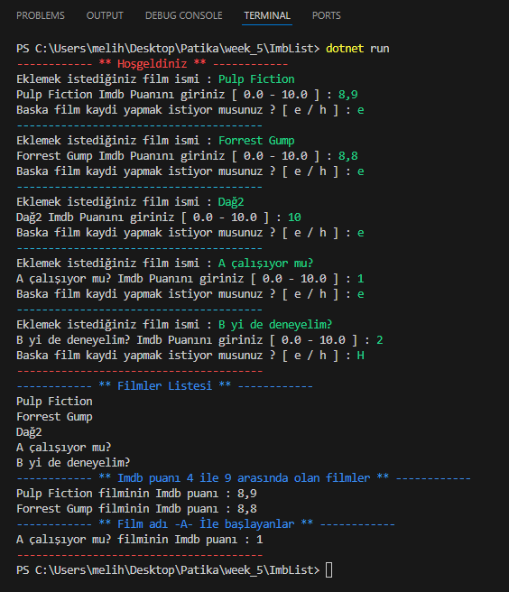

# Pratik - IMDB Listesi
Aşağıda belirtilen adımları gerçekleştirerek bir Imdb - Film Listesi oluşturuyoruz. Programın tamamı Program.cs dosyasında.

## 1- Sinema Filmlerini listeleyeceğimiz bir liste oluşturalım.
```C#
List<Movies> movie = new List<Movies>();
```

## 2- Film için propertyler -> Imdb Puanı (Double) - İsmi
```C#
internal class Movies
{
    public double ImbPuan { get; set; }
    public string? Name { get; set; }
}
```

## 3- Kullanıcıdan sınırsız sayıda film adı ve imdb puanı isteyip bu bilgilerle nesneler oluşturulup liste doldurulacak.

Kullanıcıya her film eklemesinden sonra yeni bir film eklemek isteyip istemediği sorulsun. Kullanıcı evet cevabını verirse döngüde başa dönülerek yeni bir film oluşturulup ilgili listeye aktarılsın. Hayır cevabı verilirse program aşağıdaki çıktıları ayrı ayrı sunarak sonlandırılsın.
```C#
tekrar2: // yanlış cevap verilirse tekrar istenir
Console.ResetColor(); // renklendirme
Console.Write("Baska film kaydi yapmak istiyor musunuz ? [ e / h ] : ");
Console.ForegroundColor = ConsoleColor.Green; // renklendirme
string? cevap = Console.ReadLine()?.ToLower();

if (cevap != "e" && cevap != "h")
{
    Console.ForegroundColor = ConsoleColor.Cyan; // renklendirme
    Console.WriteLine("Tanimlanmayan bir giris yaptiniz. Lütfen [ e / h ] giriniz");
    goto tekrar2;
}

if (cevap == "h")
{
    Console.ForegroundColor = ConsoleColor.Red; // renklendirme
    Console.WriteLine("---------------------------------------");
    Console.ResetColor(); // renklendirme
    break;
}
```


## 4- Uygulamanın sonunda

- Bütün filmler listelensin.
- Imdb puanı 4 ile 9 arasında olan bütün filmler listelensin.
- İsmi 'A' ile başlayan filmler ve imdb puanları listelensin.

