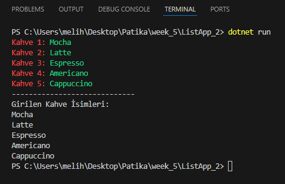

## Pratik - Lists 2
Bir kahve içsek bize iyi gelecek!

Kullanıcının konsoldan gireceği 5 kahve ismiyle bir liste oluşturup, bu listeyi foreach döngüsüyle yazdıralım.

## Code:
```C#
// kahve listesi
List<string?> coffe = new List<string?>(); // null değer olabilir

// kullanıcan kahve ismi alıyorum
for (int i = 0; i < 5; i++)
{
    Console.ForegroundColor = ConsoleColor.Red; // renklendirme
    Console.Write($"Kahve {i + 1}: ");
    Console.ForegroundColor = ConsoleColor.Green; // renklendirme
    string? x = Console.ReadLine();
    coffe.Add(x);
    Console.ResetColor(); // renklendirme
}

Console.WriteLine("-----------------------------");
Console.WriteLine("Girilen Kahve İsimleri:");

// ekrana yazdırıyoruz
foreach (string? i in coffe)
{
    Console.WriteLine(i);
}
```

## Output:
