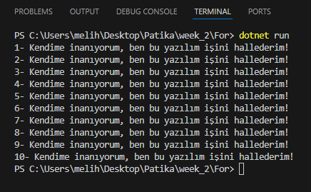
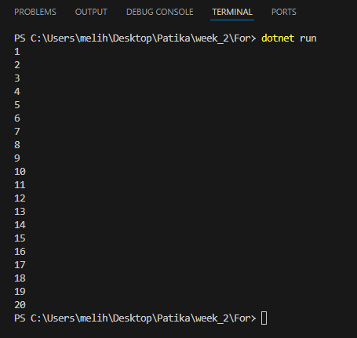
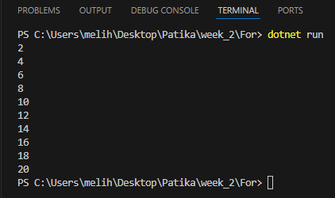
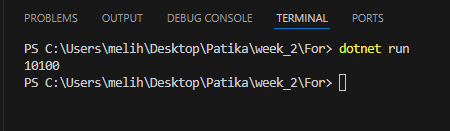
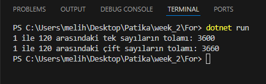

# For dögüsü

### Konsol ekranına 10 kere "Kendime inanıyorum, ben bu yazılım işini hallederim!" yazdırınız.
## Kod1:
```bash

for(byte i = 0; i <= 10; i++)
{
    Console.WriteLine("Kendime inanıyorum, ben bu yazılım işini hallederim!");
}

```

## Output1:

---


### 1 ile 20 arasındaki sayıları konsol ekranına yazdırınız.
## Kod2:
```bash

for(byte i = 1; i <= 20; i++)
{
    Console.WriteLine(i);
}

```

## Output2:

---


### 1 ile 20 arasındaki çift sayıları konsol ekranına yazdırınız.
## Kod3:
```bash

for(byte i = 1; i <= 20; i++)
{
    int x = i % 2;

    if(x == 0)
        Console.WriteLine(i);
}

```

## Output3:

---


### 50 ile 150 arasındaki sayıların toplamını ekrana yazdırınız.
## Kod4:
```bash

int toplam = 0;
for(int i = 50; i <= 150; i++)
{
    toplam = toplam + i; // toplam += i
}
Console.WriteLine(toplam);

```

## Output4:

---


### 1 ile 120 arasındaki tek ve çift sayıların toplamlarını ayrı ayrı ekrana yazdırınız.
## Kod5:
```bash

int toplam_1 = 0; 
int toplam_2 = 0;

for (int i = 1; i <= 120; i++)
{
    int x = i % 2;
    if (x == 0)
    {
        toplam_1 += i;
    }
    else
    {
        toplam_2 += i;
    }
}

Console.WriteLine($"1 ile 120 arasındaki tek sayıların tolamı: {toplam_2}");
Console.WriteLine($"1 ile 120 arasındaki çift sayıların tolamı: {toplam_1}");

```

## Output5:

