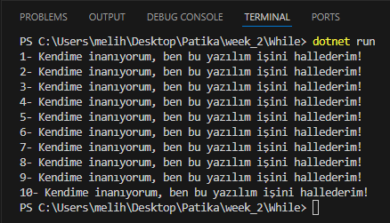
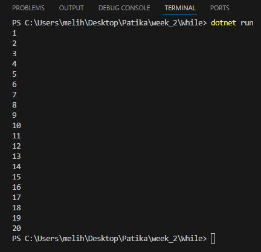
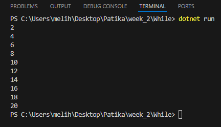
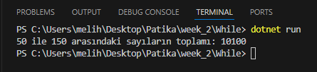
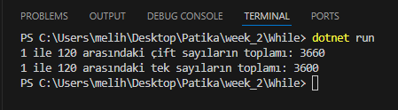

# While döngüsü ile örnekler

### Konsol ekranına 10 kere "Kendime inanıyorum, ben bu yazılım işini hallederim!" yazdırınız.
## Kod1:
```C#

byte döngü_sayisi = 1;

while(döngü_sayisi <= 10)
{
    Console.WriteLine($"{döngü_sayisi}- Kendime inanıyorum, ben bu yazılım işini hallederim!");
    döngü_sayisi++;
}

```

## Output1:

---
---


### 1 ile 20 arasındaki sayıları konsol ekranına yazdırınız.
## Kod2:
```C#

byte döngü_sayisi = 1;

while(döngü_sayisi <= 20)
{
    Console.WriteLine(döngü_sayisi);
    döngü_sayisi++;
}

```

## Output2:

---
---


### 1 ile 20 arasındaki çift sayıları konsol ekranına yazdırınız.
## Kod3:
```C#

byte döngü_sayisi = 1;

while(döngü_sayisi <= 20)
{
    int kalan = döngü_sayisi % 2;
    if(kalan == 0)
        Console.WriteLine(döngü_sayisi);
    
    döngü_sayisi++;
}

```

## Output3:

---
---


### 50 ile 150 arasındaki sayıların toplamını ekrana yazdırınız.
## Kod4:
```C#

byte basla = 50;
int toplam = 0;

while(basla <= 150)
{
    toplam += basla;
    basla++;
}
Console.WriteLine($"50 ile 150 arasındaki sayıların toplamı: {toplam}");

```

## Output4:

---
---


### 1 ile 120 arasındaki tek ve çift sayıların toplamlarını ayrı ayrı ekrana yazdırınız.
## Kod5:
```C#

byte basla = 1;
int toplam_çift = 0;
int toplam_tek = 0;

while (basla <= 120)
{
    int kalan = basla % 2;
    if (kalan == 0)
    {
        toplam_çift += basla;
    }
    else
    {
        toplam_tek += basla;
    }
    basla++;
}
Console.WriteLine($"1 ile 120 arasındaki çift sayıların toplamı: {toplam_çift}");
Console.WriteLine($"1 ile 120 arasındaki tek sayıların toplamı: {toplam_tek}");

```

## Output5:
