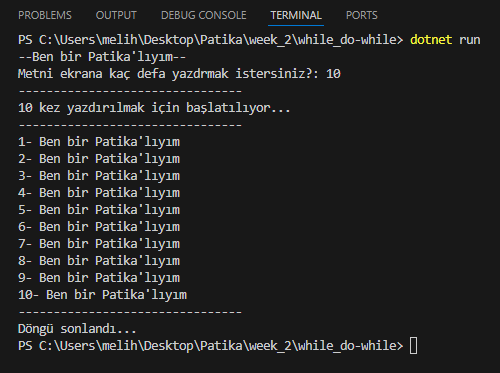
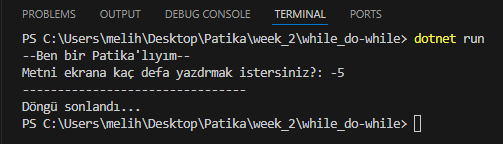
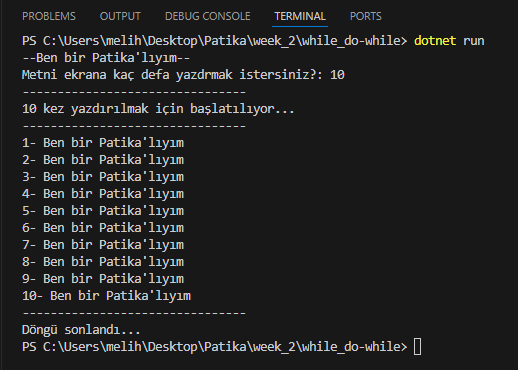
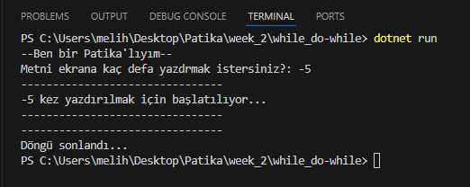

# Pratik - While vs Do-While
- Kullanıcının girdiği bir limit değerine kadar 0'dan bir sayaç çalıştırıp artırarak, ekrana " Ben bir Patika'lıyım " yazdırınız.
- Örnek inputlar : 10 ve -5

## while:
```C#

int limit; // kulanıcıdan alınacak değer
byte sayaç = 0; // uygulamayı çalıştırmak için yükseltilecek değer
Console.Write("--Ben bir Patika'lıyım--\nMetni ekrana kaç defa yazdrmak istersiniz?: ");
limit = Convert.ToInt32(Console.ReadLine());

while(sayaç <= limit)
{
    if(sayaç == 0) // sıfırıncı satır başlatma satırı olsun
    {
        Console.WriteLine("--------------------------------");
        Console.WriteLine($"{limit} kez yazdırılmak için başlatılıyor...");
        Console.WriteLine("--------------------------------");
    }
    else
    {
        Console.WriteLine($"{sayaç}- Ben bir Patika'lıyım");
    }
    sayaç++;
}
Console.WriteLine("--------------------------------");
Console.WriteLine("Döngü sonlandı...");

```

## while_Output 10:


## while_Output -5:


---
---


## do-while:
```C#

int limit; // kulanıcıdan alınacak değer
byte sayaç = 0; // uygulamayı çalıştırmak için yükseltilecek değer
Console.Write("--Ben bir Patika'lıyım--\nMetni ekrana kaç defa yazdrmak istersiniz?: ");
limit = Convert.ToInt32(Console.ReadLine());
do
{
    if(sayaç == 0) // sıfırıncı satır başlatma satırı olsun
    {
        Console.WriteLine("--------------------------------");
        Console.WriteLine($"{limit} kez yazdırılmak için başlatılıyor...");
        Console.WriteLine("--------------------------------");
    }
    else
    {
        Console.WriteLine($"{sayaç}- Ben bir Patika'lıyım");
    }
    sayaç++;
    
} while (sayaç <= limit);
Console.WriteLine("--------------------------------");
Console.WriteLine("Döngü sonlandı...");

```

## do-while_Output 10:


## while_Output -5:
