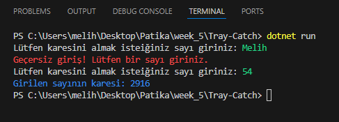

# Pratik - Try-Catch

## 1- Kullanıcıdan bir sayı girmesini isteyen bir program yazıyoruz. Kullanıcı geçerli bir sayı girdiğinde bu sayının karesini ekrana yazdırıyoruz.
```C#
// bunu doğru yapana kadar tekrarlıyacağız
bool devammi = true;
while (devammi)
{
    Console.Write("Lütfen karesini almak isteiğiniz sayı giriniz: ");
    Console.ForegroundColor = ConsoleColor.Green; // renklendirme
    int sayi = Convert.ToInt32(Console.ReadLine());

    Console.ForegroundColor = ConsoleColor.Blue; // renklendirme
    Console.WriteLine($"Girilen sayının karesi: {sayi * sayi}");
    // kod hatasız devam ederse sonlanır
    devammi = false;
    Console.ResetColor(); // renklendirme
}
```

## 2- Kullanıcı geçersiz bir giriş yaparsa (sayı yerine harf veya sembol girmesi gibi), "Geçersiz giriş! Lütfen bir sayı giriniz." şeklinde bir hata mesajı gösteriyoruz.
```C#
// tray-catch
try
{
    // kodlar

}
catch (Exception)
{
    Console.ForegroundColor = ConsoleColor.Red; // renklendirme
    Console.WriteLine("Geçersiz giriş! Lütfen bir sayı giriniz.");
    Console.ResetColor(); // renklendirme
}
```

## 3- OutOutput:
