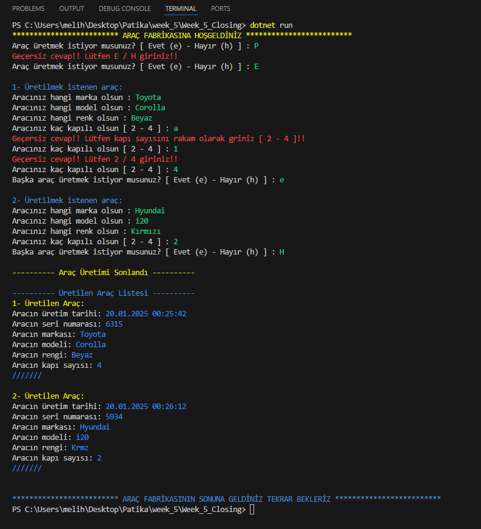

# 💣Hafta 5 - Kapanış
Bir araba fabrikasında araba üretiyoruz. Program.cs dosyasında kodların tamamı vardır. Kod çıktısı için readme.md sayfa sonuna bakınız. [Output'a git.](#son)

## Araba -> Üretim Tarihi, Seri Numarası, Marka, Model, Renk, Kapı Sayısı
```C#
class Araba
{
    public DateTime UretimTarihi;
    public int SeriNo;
    public string? Marka;
    public string? Model;
    public string? Renk;
    public int KapiSayisi;

    // 3- Üretim Tarihi değeri araba üretilirken otomatik olarak o an olarak atanacak.
    public Araba()
    {
        // üretim tarihi otamatik atandı
        UretimTarihi = DateTime.Now;
        // seri no belirlendi
        Random sr = new Random();
        SeriNo = sr.Next(1000, 10000);
    }


}
```

# Program akışı:

## 1- Konsol ekranından kullanıcıya araba üretmek isteyip istemediğini soralım. Üretmek istiyorsa e, istemiyorsa h harfi ile yanıt versin. Büyük - Küçük harf duyarlılığını ortadan kaldıralım. Geçersiz bir cevap verirse, bu cevabın geçersiz olduğunu söyleyerek aynı soruyu tekrar yöneltelim.
```C#
basla:
Console.ResetColor();
Console.Write("Araç üretmek istiyor musunuz? [ Evet (e) - Hayır (h) ] : ");
Console.ForegroundColor = ConsoleColor.Green;
string? cevap = Console.ReadLine();
string? cevap1 = cevap?.ToLower(); // büyük küçük duyarlılığı kalktı


if (cevap1 != "e" && cevap1 != "h")
{
    Console.ForegroundColor = ConsoleColor.Red;
    Console.WriteLine("Geçersiz cevap!! Lütfen E / H giriniz!!");
    goto basla;
}
```


## (2- 4-) Kullanıcının cevabı hayır programı sonlandıralım, evet ise bir araba nesnesi üretip özelliklerini konsol ekranından kullanıcıya girdirelim. Kapı Sayısı için sayısal olmayan bir değer atanılmaya çalışılırsa programın exception fırlatmasını engelleyelim, uyarı mesajı verelim ve kullanıcıyı yeniden o satıra yönlendirelim. (goto komutunu araştırınız.)
```C#
do
{

    if (cevap1 == "h")
    {
        uretim = "h";
        break;
    }

        Araba araba = new Araba();
    // 4- Kapı Sayısı için sayısal olmayan bir değer atanılmaya çalışılırsa programın exception fırlatmasını engelleyelim, 
    // uyarı mesajı verelim ve kullanıcıyı yeniden o satıra yönlendirelim. (goto komutunu araştırınız.)
    // Marka, 
    Console.ForegroundColor = ConsoleColor.DarkBlue;
    Console.WriteLine($"\n{t}- Üretilmek istenen araç:");
    Console.ResetColor();
    Console.Write("Aracınız hangi marka olsun : ");
    Console.ForegroundColor = ConsoleColor.Green;
    araba.Marka = Console.ReadLine();
    // Model, Renk, Kapı Sayısı
    Console.ResetColor();
    Console.Write("Aracınız hangi model olsun : ");
    Console.ForegroundColor = ConsoleColor.Green;
    araba.Model = Console.ReadLine();
    // Renk, Kapı Sayısı
    Console.ResetColor();
    Console.Write("Aracınız hangi renk olsun : ");
    Console.ForegroundColor = ConsoleColor.Green;
    araba.Renk = Console.ReadLine();

kapi:
    // Kapı Sayısı
    try
    {
        Console.ResetColor();
        Console.Write("Aracınız kaç kapılı olsun [ 2 - 4 ] : ");
        Console.ForegroundColor = ConsoleColor.Green;
        araba.KapiSayisi = Convert.ToInt16(Console.ReadLine());

    }
    catch (Exception)
    {
        Console.ForegroundColor = ConsoleColor.Red;
        Console.WriteLine("Geçersiz cevap!! Lütfen kapı sayısını rakam olarak griniz [ 2 - 4 ]!!");
        goto kapi;
    }

    // kapı sayısının 2 - 4 olmasını kontrol ediyoruz
    if (araba.KapiSayisi != 2 && araba.KapiSayisi != 4)
    {
        Console.ForegroundColor = ConsoleColor.Red;
        Console.WriteLine("Geçersiz cevap!! Lütfen 2 / 4 giriniz!!");
        goto kapi;
    }
}
while (uretim == "e")
```

## 3- Üretim Tarihi değeri araba üretilirken otomatik olarak o an olarak atanacak.
```C#
// 3- Üretim Tarihi değeri araba üretilirken otomatik olarak o an olarak atanacak.
public Araba()
{
    // üretim tarihi otamatik atandı
    UretimTarihi = DateTime.Now;
    // seri no belirlendi
    Random sr = new Random();
    SeriNo = sr.Next(1000, 10000);
}
```


## 5- Oluşturulan araba nesnesini arabalar isimli bir listeye atayınız.
```C#
List<Araba> ArabaListe = new List<Araba>();

///
ArabaListe.Add(araba);
```

## 6- Kullanıcıya başka araba oluşturmak isteyip istemediğini sorunuz, evet ise program akışında 2. aşamaya geri dönünüz ve yeni bir araba üretip listeye ekleyiniz. Cevap hayır ise arabalar listesinin bütün elemanlarının Seri numaralarını ve markalarını yazdırınız

```C#
devammi:
Console.ResetColor();
Console.Write("Başka araç üretmek istiyor musunuz? [ Evet (e) - Hayır (h) ] : ");
Console.ForegroundColor = ConsoleColor.Green;
string? uretim1 = Console.ReadLine();
uretim = uretim1?.ToLower();

if (uretim != "e" && uretim != "h")
{
    Console.ForegroundColor = ConsoleColor.Red;
    Console.WriteLine("Geçersiz cevap!! Lütfen E / H giriniz!!");
    goto devammi;
}

Console.ForegroundColor = ConsoleColor.DarkYellow;
Console.WriteLine("\n---------- Araç Üretimi Sonlandı ----------");

// 6- devam - ve yeni bir araba üretip listeye ekleyiniz. 
// Cevap hayır ise arabalar listesinin bütün elemanlarının Seri numaralarını ve markalarını yazdırınız

Console.ForegroundColor = ConsoleColor.DarkBlue;
Console.WriteLine("\n---------- Üretilen Araç Listesi ----------");
int i = 1;
foreach (var arac in ArabaListe)
{
    Console.ForegroundColor = ConsoleColor.DarkYellow;
    Console.WriteLine($"{i}- Üretilen Araç:");

    Console.ResetColor();
    Console.Write($"Aracın üretim tarihi: ");
    Console.ForegroundColor = ConsoleColor.Blue;
    Console.WriteLine($"{arac.UretimTarihi}");

    Console.ResetColor();
    Console.Write($"Aracın seri numarası: ");
    Console.ForegroundColor = ConsoleColor.Blue;
    Console.WriteLine($"{arac.SeriNo}");

    Console.ResetColor();
    Console.Write($"Aracın markası: ");
    Console.ForegroundColor = ConsoleColor.Blue;
    Console.WriteLine($"{arac.Marka}");

    Console.ResetColor();
    Console.Write($"Aracın modeli: ");
    Console.ForegroundColor = ConsoleColor.Blue;
    Console.WriteLine($"{arac.Model}");

    Console.ResetColor();
    Console.Write($"Aracın rengi: ");
    Console.ForegroundColor = ConsoleColor.Blue;
    Console.WriteLine($"{arac.Renk}");

    Console.ResetColor();
    Console.Write($"Aracın kapı sayısı: ");
    Console.ForegroundColor = ConsoleColor.Blue;
    Console.WriteLine($"{arac.KapiSayisi}");

    Console.ForegroundColor = ConsoleColor.Blue;
    Console.WriteLine("///////\n");

    i++;

}

Console.ForegroundColor = ConsoleColor.DarkBlue;
Console.WriteLine("\n************************* ARAÇ FABRİKASININ SONUNA GELDİNİZ TEKRAR BEKLERİZ *************************");
Console.ResetColor();
```


# <a id="son">Output:</a>

